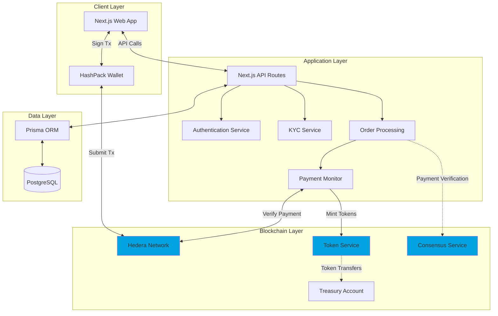
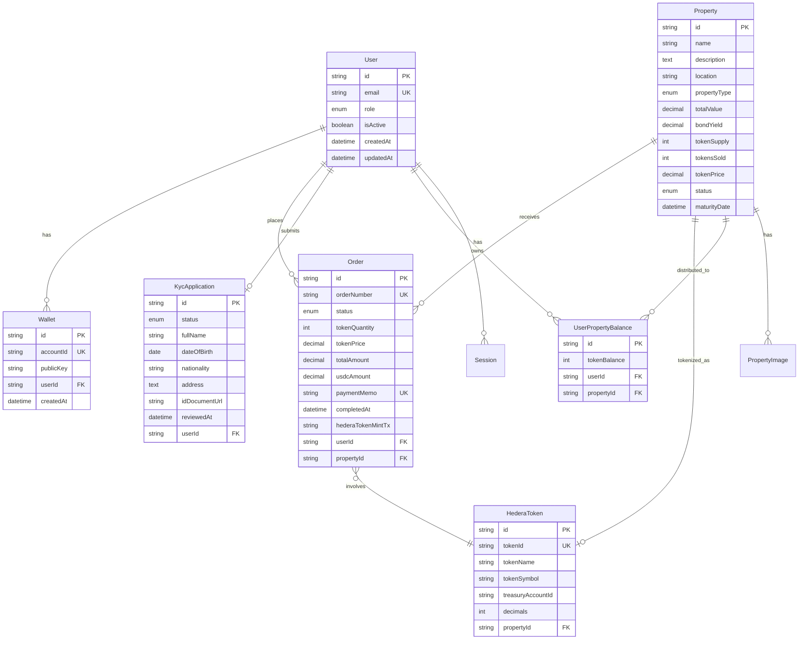
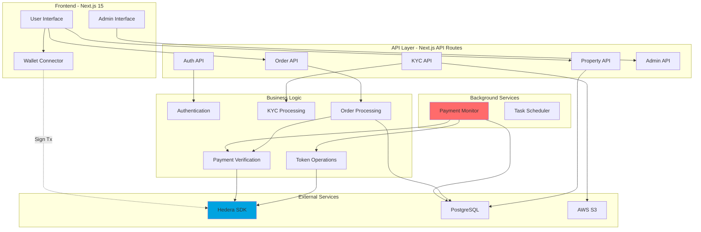
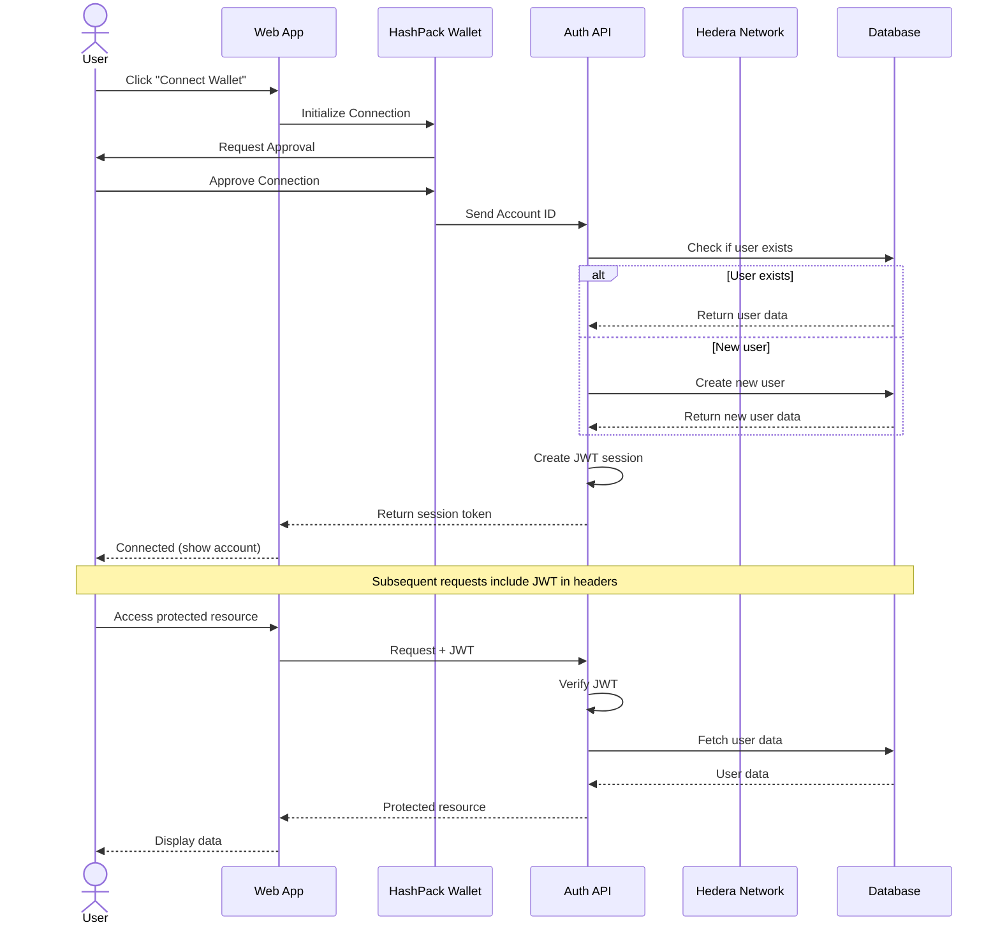
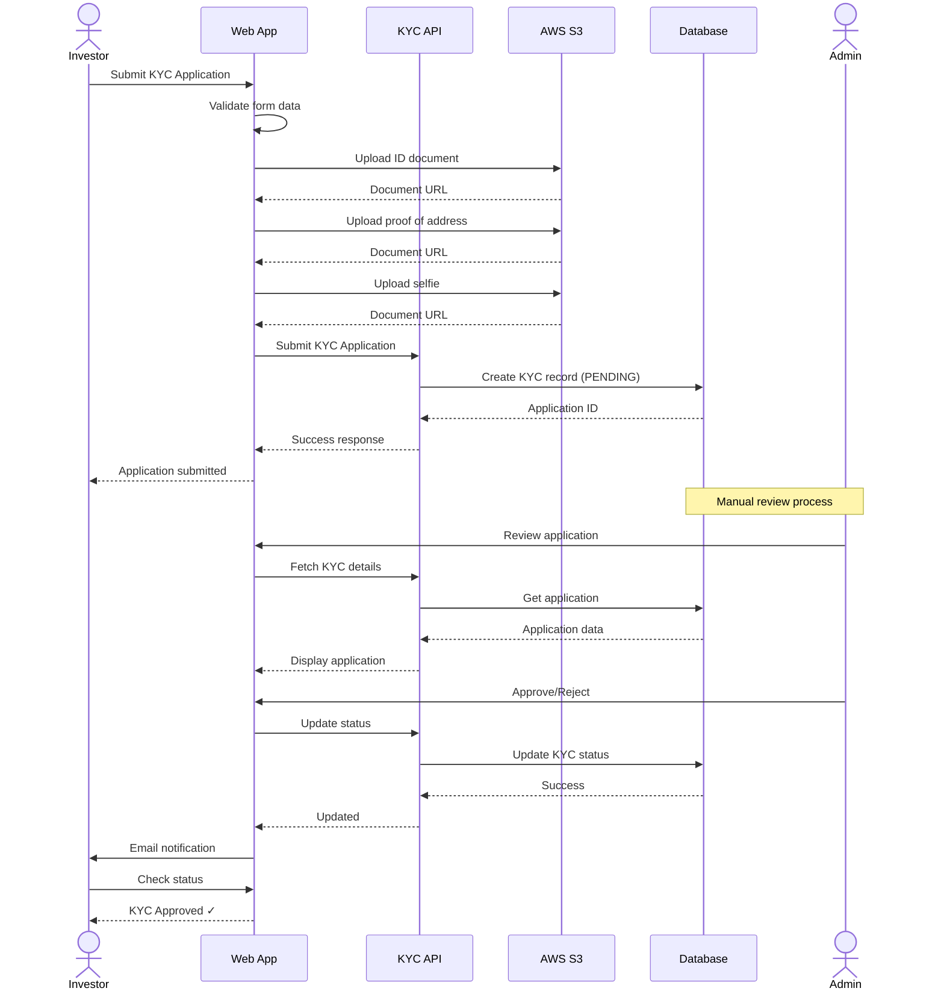
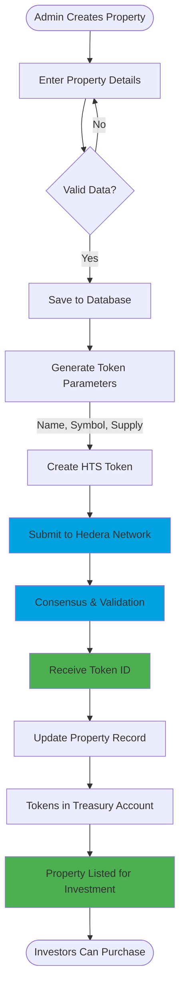
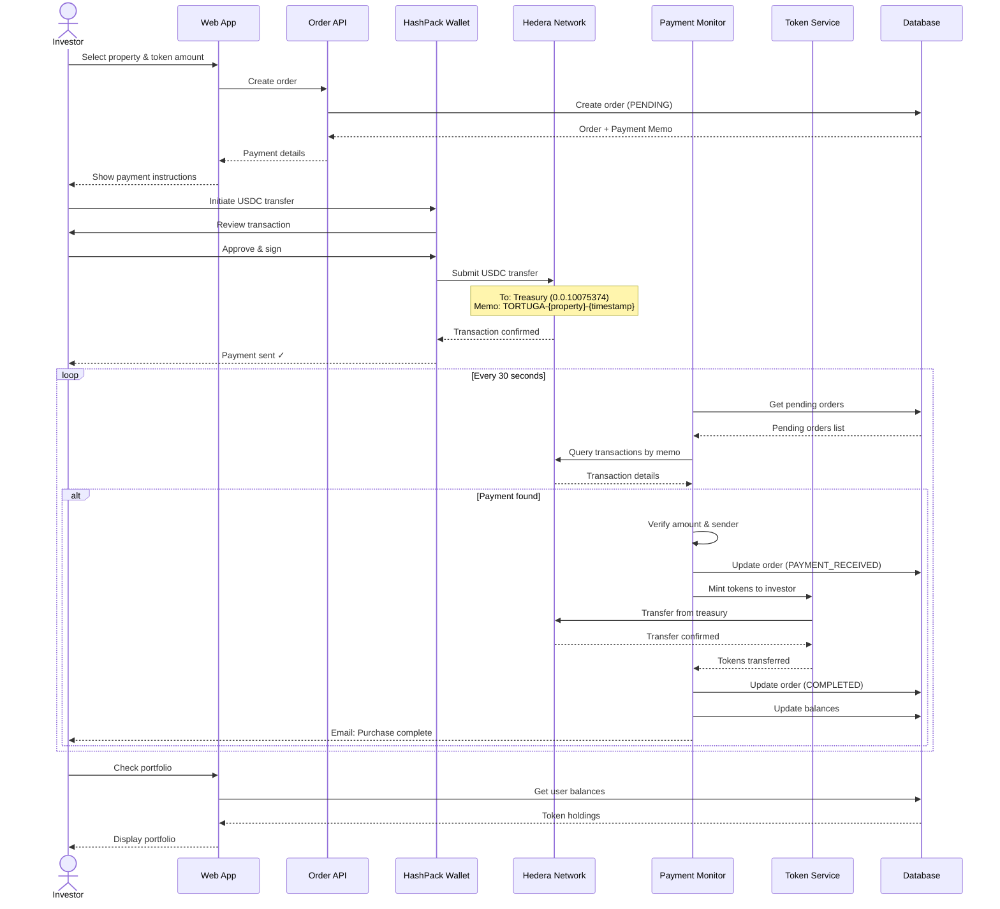
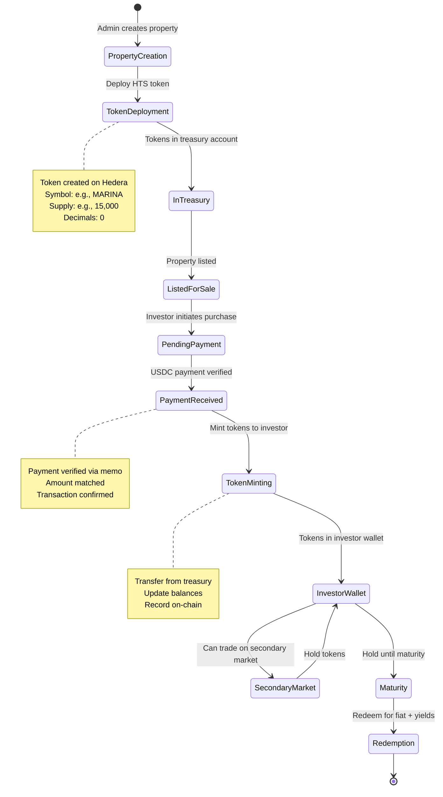
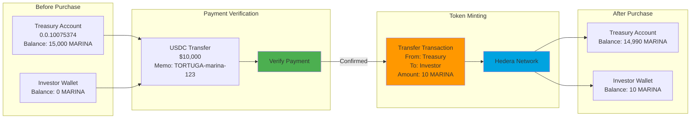

# Tortuga - Real Estate Tokenization Platform

A decentralized platform for fractional real estate investment using Hedera Hashgraph, enabling transparent, secure, and efficient property tokenization and trading.

## Important Links

- **Pitch Deck**: [View on DocSend](https://docsend.com/view/6ubwequmbg4zkg2s)
- **Certificate**: [View on Google Drive](https://drive.google.com/file/d/1697Qg4Ejd_tA18BhkffvDBG9cp78ulyb/view?usp=sharing)

---

## Table of Contents

1. [Project Overview](#project-overview)
2. [Project Architecture](#project-architecture)
3. [Hedera Services Integration](#hedera-services-integration)
4. [High-Level Design](#high-level-design)
5. [Token Flow](#token-flow)
6. [Technology Stack](#technology-stack)
7. [Security Considerations](#security-considerations)
8. [Getting Started](#getting-started)

---

## Project Overview

Tortuga transforms traditional real estate investment by leveraging blockchain technology to:

- **Tokenize Real Estate Assets**: Convert physical properties into fungible tokens on Hedera
- **Enable Fractional Ownership**: Allow investors to purchase fractions of high-value properties
- **Provide Liquidity**: Create a secondary market for traditionally illiquid assets
- **Ensure Transparency**: All transactions and ownership records on a public ledger
- **Streamline Compliance**: Built-in KYC/AML verification for regulatory compliance

### Key Features

- 🏢 **Property Tokenization**: Create HTS tokens representing real estate ownership
- 💰 **USDC Payments**: Stable, fiat-backed cryptocurrency for investments
- 🔐 **KYC Verification**: Compliant investor onboarding
- 📊 **Portfolio Management**: Real-time tracking of investments and returns
- 👔 **Admin Dashboard**: Property and order management interface
- 🔗 **HashPack Integration**: Seamless wallet connectivity

---

## Project Architecture

### System Architecture



### Monorepo Structure

```
tortuga-hedera/
├── apps/
│   ├── web/                    # Next.js frontend application
│   │   ├── src/
│   │   │   ├── app/            # App router pages
│   │   │   │   ├── properties/ # Property browsing & details
│   │   │   │   ├── portfolio/  # User portfolio
│   │   │   │   ├── admin/      # Admin dashboard
│   │   │   │   ├── kyc/        # KYC application
│   │   │   │   └── api/        # API routes
│   │   │   ├── components/     # Shared UI components
│   │   │   └── lib/            # Utility functions
│   │   └── public/             # Static assets
│   │
├── packages/
│   ├── database/               # Prisma schema & client
│   │   ├── prisma/
│   │   │   └── schema.prisma   # Database schema
│   │   └── src/                # Database utilities
│   │
│   └── hedera/                 # Hedera SDK wrapper
│       └── src/
│           ├── token.ts        # HTS operations
│           ├── payment.ts      # Payment verification
│           └── client.ts       # Hedera client setup
│
├── scripts/
│   └── monitor-payments.ts     # Background payment monitor
│
└── pnpm-workspace.yaml         # Workspace configuration
```

### Database Schema



---

## Hedera Services Integration

### 1. Hedera Token Service (HTS)

**Purpose**: Tokenize real estate properties as fungible tokens

**Implementation**:

```typescript
// packages/hedera/src/token.ts

export async function createPropertyToken(params: {
  tokenName: string;
  tokenSymbol: string;
  tokenSupply: number;
  treasuryAccountId: string;
  adminKey: PrivateKey;
}) {
  const client = createHederaClient();

  const tokenCreateTx = new TokenCreateTransaction()
    .setTokenName(params.tokenName)
    .setTokenSymbol(params.tokenSymbol)
    .setTokenType(TokenType.FungibleCommon)
    .setDecimals(0)
    .setInitialSupply(params.tokenSupply)
    .setTreasuryAccountId(params.treasuryAccountId)
    .setAdminKey(params.adminKey)
    .setSupplyKey(params.adminKey)
    .setFreezeDefault(false);

  const txResponse = await tokenCreateTx.execute(client);
  const receipt = await txResponse.getReceipt(client);

  return {
    tokenId: receipt.tokenId?.toString(),
    transactionId: txResponse.transactionId.toString()
  };
}
```

**Usage**:
- Create unique tokens for each property
- Tokens represent fractional ownership
- Non-divisible (0 decimals) for whole-unit ownership
- Treasury account holds unsold tokens

**Example**:
- Property: "Marina Bay Luxury Residences"
- Token: `0.0.5001234` (MARINA)
- Supply: 15,000 tokens @ $1,000 each
- Total Value: $15,000,000

### 2. USDC Token Transfers

**Purpose**: Accept stable cryptocurrency payments for property investments

**Token**: `0.0.456858` (USDC on Hedera Mainnet)

**Implementation**:

```typescript
// apps/web/src/app/api/orders/create/route.ts

export async function POST(request: NextRequest) {
  const { propertyId, tokensAmount } = await request.json();

  // Calculate USDC amount (6 decimals)
  const usdcAmount = tokenPrice * tokensAmount;
  const usdcWithDecimals = Math.floor(usdcAmount * 1_000_000);

  // Create order with payment memo
  const order = await prisma.order.create({
    data: {
      userId,
      propertyId,
      tokenQuantity: tokensAmount,
      usdcAmount,
      paymentMemo: `TORTUGA-${propertyId}-${timestamp}`,
      status: 'PENDING_PAYMENT'
    }
  });

  return {
    paymentDetails: {
      treasuryAccount: '0.0.10075374',
      usdcAmount,
      memo: order.paymentMemo
    }
  };
}
```

**Payment Flow**:
1. User initiates purchase
2. System generates unique payment memo
3. User sends USDC to treasury account with memo
4. Background monitor verifies payment
5. System mints property tokens to user

### 3. Hedera Consensus Service (HCS)

**Purpose**: Immutable audit trail for property transactions

**Implementation**:

```typescript
// packages/hedera/src/consensus.ts

export async function logPropertyTransaction(params: {
  topicId: string;
  orderId: string;
  propertyId: string;
  userId: string;
  tokenAmount: number;
  usdcAmount: number;
  timestamp: Date;
}) {
  const client = createHederaClient();

  const message = JSON.stringify({
    type: 'PROPERTY_PURCHASE',
    orderId: params.orderId,
    propertyId: params.propertyId,
    userId: params.userId,
    tokenAmount: params.tokenAmount,
    usdcAmount: params.usdcAmount,
    timestamp: params.timestamp.toISOString()
  });

  const submitTx = new TopicMessageSubmitTransaction()
    .setTopicId(params.topicId)
    .setMessage(message);

  const txResponse = await submitTx.execute(client);
  const receipt = await txResponse.getReceipt(client);

  return {
    sequenceNumber: receipt.topicSequenceNumber,
    transactionId: txResponse.transactionId.toString()
  };
}
```

**Benefits**:
- Tamper-proof transaction history
- Regulatory compliance audit trail
- Transparent ownership records
- Dispute resolution evidence

### 4. HashPack Wallet Integration

**Purpose**: User-friendly wallet connectivity and transaction signing

**Implementation**:

```typescript
// apps/web/src/app/_components/auth-provider.tsx

export function AuthProvider({ children }: { children: ReactNode }) {
  const [hashconnect, setHashconnect] = useState<HashConnect | null>(null);

  useEffect(() => {
    initializeHashConnect();
  }, []);

  const initializeHashConnect = async () => {
    const hc = new HashConnect(
      LedgerId.MAINNET,
      projectId,
      {
        name: 'Tortuga',
        description: 'Real Estate Tokenization Platform',
        icons: ['https://tortuga.estate/icon.png']
      }
    );

    // Listen for pairing events
    hc.pairingEvent.on(async (pairingData) => {
      const accountId = pairingData.accountIds[0];
      // Create user session
      await createUserSession(accountId);
    });

    await hc.init();
    setHashconnect(hc);
  };

  return (
    <AuthContext.Provider value={{ hashconnect, connect, disconnect }}>
      {children}
    </AuthContext.Provider>
  );
}
```

**Features**:
- One-click wallet connection
- Secure transaction signing
- Multi-account support
- Real-time balance updates

---

## High-Level Design

### System Components



### Authentication & Authorization Flow



### KYC Verification Flow



---

## Token Flow

### Property Tokenization Flow



### Investment & Token Distribution Flow



### Complete End-to-End Token Lifecycle



### Token Transfer Mechanism



---

## Technology Stack

### Frontend
- **Framework**: Next.js 15 (App Router)
- **Language**: TypeScript
- **Styling**: Tailwind CSS
- **UI Components**: shadcn/ui
- **State Management**: React Hooks
- **Wallet Integration**: HashConnect (HashPack)
- **Forms**: React Hook Form + Zod

### Backend
- **Runtime**: Node.js
- **API**: Next.js API Routes
- **ORM**: Prisma
- **Database**: PostgreSQL
- **Authentication**: JWT + Database Sessions
- **File Storage**: AWS S3
- **Background Jobs**: Custom payment monitor

### Blockchain
- **Network**: Hedera Hashgraph Mainnet
- **SDK**: @hashgraph/sdk
- **Wallet**: HashPack (via HashConnect)
- **Services**:
  - Hedera Token Service (HTS)
  - Hedera Consensus Service (HCS)
  - Crypto Transfer Service

### DevOps
- **Monorepo**: Turborepo + pnpm workspaces
- **Package Manager**: pnpm
- **Version Control**: Git
- **CI/CD**: GitHub Actions
- **Deployment**: Vercel (Frontend), AWS (Backend services)

---

## Security Considerations

### Smart Contract Security
- **No Smart Contracts**: Hedera Token Service provides native token functionality
- **Key Management**: Multi-signature treasury account
- **Token Supply**: Fixed supply prevents inflation attacks
- **Freeze Protection**: Tokens cannot be frozen by default

### Payment Security
- **Memo Verification**: Unique payment memos prevent double-spending
- **Amount Validation**: Exact USDC amount verification
- **Sender Verification**: Confirm payment from authenticated user
- **Idempotency**: Orders processed exactly once

### Data Security
- **Encryption at Rest**: Database encryption enabled
- **Encryption in Transit**: HTTPS/TLS for all connections
- **Secrets Management**: Environment variables, never committed
- **File Security**: S3 bucket policies and signed URLs

### Authentication Security
- **JWT Tokens**: Short-lived access tokens
- **Session Management**: Database-backed sessions for admin
- **Wallet Signatures**: Cryptographic proof of ownership
- **CSRF Protection**: Next.js built-in protections

### Compliance
- **KYC/AML**: Document verification before investment
- **Audit Trail**: Immutable HCS records
- **Data Privacy**: GDPR-compliant data handling
- **Access Control**: Role-based permissions (Admin/Investor)

---

## Getting Started

### Prerequisites

```bash
# Node.js 18+
node --version

# pnpm
npm install -g pnpm

# PostgreSQL 14+
psql --version

# Hedera Account (Testnet or Mainnet)
# - Get from https://portal.hedera.com
```

### Environment Setup

```bash
# Clone repository
git clone https://github.com/yourusername/tortuga-hedera.git
cd tortuga-hedera

# Install dependencies
pnpm install

# Configure environment variables
cp apps/web/.env.example apps/web/.env

# Edit .env with your credentials:
# - DATABASE_URL
# - HEDERA_OPERATOR_ID
# - HEDERA_OPERATOR_KEY
# - HEDERA_NETWORK
# - JWT_SECRET
# - AWS_* credentials
```

### Database Setup

```bash
# Run migrations
cd packages/database
pnpm db:migrate

# Seed database (optional)
pnpm db:seed
```

### Run Development Server

```bash
# From root directory
pnpm dev

# Web app: http://localhost:3000
# API: http://localhost:3000/api
```

### Deploy Property Token

```bash
# Run admin setup
cd apps/web
pnpm setup:admin

# Create property via admin UI:
# http://localhost:3000/admin/properties/create
```

### Start Payment Monitor

```bash
# In separate terminal
pnpm monitor:payments

# Monitors pending orders every 30 seconds
# Verifies USDC payments
# Mints tokens to investors
```

---

## Architecture Decisions

### Why Hedera?

1. **Performance**: 10,000+ TPS vs. Ethereum's ~15 TPS
2. **Cost**: $0.0001 per transaction vs. Ethereum's $50-200 gas fees
3. **Finality**: 3-5 seconds vs. Ethereum's 10-15 minutes
4. **Carbon Negative**: Environmentally sustainable
5. **Native Token Service**: No smart contract vulnerabilities
6. **Regulatory Compliance**: Governed by established enterprises

### Why Next.js?

- **Full-Stack**: API routes eliminate separate backend
- **Performance**: Server-side rendering + caching
- **Developer Experience**: File-based routing, TypeScript support
- **Deployment**: Vercel integration for instant deploys
- **SEO**: Server components for search optimization

### Why PostgreSQL?

- **ACID Compliance**: Critical for financial transactions
- **Complex Queries**: Advanced filtering and analytics
- **JSON Support**: Flexible schema for blockchain data
- **Scalability**: Proven performance at scale
- **Prisma Integration**: Type-safe database access

---

## Contact

- **Website**: https://tortuga.estate
- **Email**: levan@tortuga.estate
- **Twitter**: [@tortuga_estate](https://x.com/tortuga_estate)

---

**Built with ❤️ using Hedera Hashgraph**
